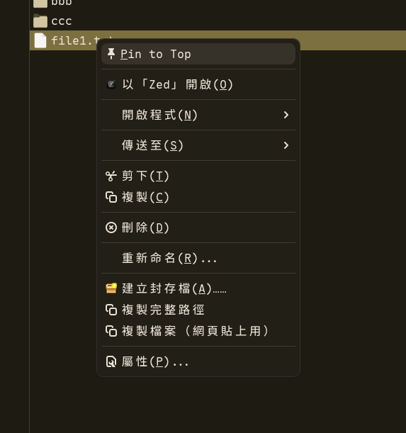
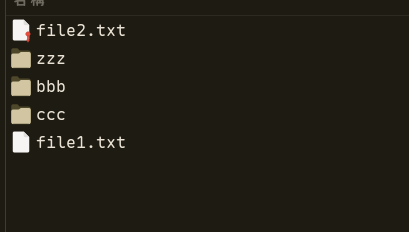

# Thunar Pin-to-Top

A modified version of [Thunar](https://gitlab.xfce.org/xfce/thunar) (Xfce's file manager) that adds a **Pin to Top** feature — pin any file or folder to always appear at the top of the file list.

Based on **Thunar 4.20.8**.

## Screenshots

| Pin to Top in context menu | Pinned file at the top |
|---|---|
|  |  |

## Features

- Right-click any file or folder and select **Pin to Top**
- Pinned items always appear at the top, regardless of sort order (name, date, size, etc.)
- Pinned files can appear above folders
- Pin emblem overlay on pinned items
- Multiple items can be pinned; they are ordered by pin time
- Pin state persists across sessions (stored via GIO metadata)
- Unpin via right-click **Unpin from Top**

## How it works

- Pin state is stored as GIO metadata (`metadata::thunar-pinned`, `metadata::thunar-pin-order`) in `~/.local/share/gvfs-metadata/`
- No extra database or config files needed
- Sort priority: **Pinned items > Folders first > Normal sort**

## Installation (Arch Linux)

### Build from source

```bash
# Install build dependencies
sudo pacman -S --needed base-devel xfce4-dev-tools intltool glib2-devel \
    gtk3 exo libxfce4ui libxfce4util gobject-introspection

# Clone this repo
git clone https://github.com/123hi123/thunar-pin.git
cd thunar-pin
git checkout pin-feature

# Build (use -j2 to limit CPU usage)
./autogen.sh --prefix=/usr --sysconfdir=/etc
make -j2

# Install (replaces system Thunar)
sudo make install

# Install pin emblem icon
sudo mkdir -p /usr/share/icons/hicolor/scalable/emblems
sudo cp icons/emblem-pinned.svg /usr/share/icons/hicolor/scalable/emblems/
sudo gtk-update-icon-cache -f -t /usr/share/icons/hicolor

# Restart Thunar
thunar -q && thunar &
```

### Uninstall (restore original Thunar)

```bash
sudo pacman -S thunar
```

## Changed files

```
thunar/thunar-file.c              # Pin API: is_pinned(), set_pinned(), get_pin_order()
thunar/thunar-file.h              # Pin function declarations + emblem constant
thunar/thunar-list-model.c        # Pin sort logic for icon/compact view
thunar/thunar-tree-view-model.c   # Pin sort logic for details view
thunar/thunar-action-manager.c    # Pin/Unpin context menu action
thunar/thunar-action-manager.h    # Action enum entry
thunar/thunar-menu.c              # Pin section at top of context menu
thunar/thunar-menu.h              # Menu section flag
thunar/thunar-standard-view.c     # Include pin section in context menu
thunarx/thunarx-file-info.h       # Query pin metadata attributes
icons/emblem-pinned.svg           # Pin emblem icon
```

## License

GPL-2.0 (same as Thunar)

## Credits

- [Thunar](https://gitlab.xfce.org/xfce/thunar) by the Xfce development team
- Pin feature developed with [Claude Code](https://claude.ai/claude-code)
